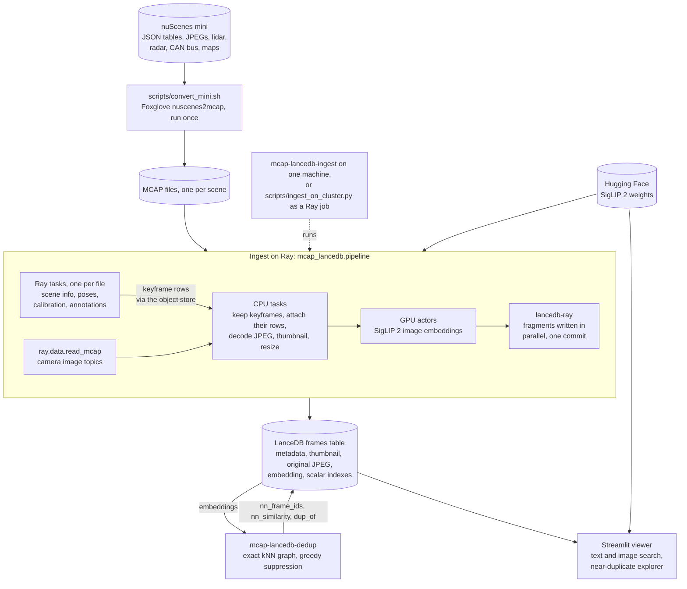

# mcap-lancedb

[](https://github.com/justinrmiller/mcap-lancedb/actions/workflows/ci.yml)
[](https://github.com/justinrmiller/mcap-lancedb/actions/workflows/ci.yml)

Embedding-based curation for robotics and AV fleet data. mcap-lancedb reads
driving logs stored as [MCAP](https://mcap.dev/), ingests their camera
keyframes into LanceDB with Ray Data, embeds them with SigLIP 2, marks
near-duplicates, and ships a Streamlit viewer for:

1. **Text-to-image search** with metadata filters: camera, location, day or
   night, pedestrians in view, object categories, and hiding near-duplicates.
2. **Interactive near-duplicate removal**: move a threshold slider and watch
   removals concentrate where the car was standing still.

The demo data is nuScenes v1.0-mini, converted to MCAP once with Foxglove's
[nuscenes2mcap](https://github.com/foxglove/nuscenes2mcap).

## Step-by-step guide

This walks through the demo on nuScenes mini: 10 scenes and 2,424 camera
keyframes. Run every command from the repository root.

### Before you start

| You need | Notes |
| --- | --- |
| [uv](https://docs.astral.sh/uv/) and git | uv installs Python 3.12 for the project, 3.11 for the converter, and every dependency. |
| About 25 GB of disk | 10 GB of nuScenes (deletable after step 3), 4.7 GB of MCAP, 6 GB of model weights, 1.7 GB environment, 450 MB per table. |
| 16 GB of RAM | The default model alone is 4.5 GB in fp32. |
| A GPU (optional) | NVIDIA (CUDA) or Apple silicon (MPS). Without one, use the faster base model. |

nuScenes is licensed for non-commercial use (CC BY-NC-SA 4.0). Read the terms
at [nuscenes.org](https://www.nuscenes.org/terms-of-use) before downloading.

### 1. Install

```bash
git clone https://github.com/justinrmiller/mcap-lancedb.git
cd mcap-lancedb
uv sync
```

This creates `.venv/` with the package, its two commands
(`mcap-lancedb-ingest` and `mcap-lancedb-dedup`), and the dev tools.

### 2. Download nuScenes mini

The converter needs the whole mini release (every sensor, not just cameras),
the CAN bus expansion and the map expansion: 5.4 GB of downloads from the
public nuScenes bucket, no login.

```bash
mkdir -p data/nuscenes/maps
```

```bash
curl -fsS https://motional-nuscenes.s3.ap-northeast-1.amazonaws.com/public/v1.0/v1.0-mini.tgz | tar -xz -C data/nuscenes
```

```bash
curl -fsSO https://motional-nuscenes.s3.ap-northeast-1.amazonaws.com/public/v1.0/can_bus.zip && unzip -q can_bus.zip -d data/nuscenes && rm can_bus.zip
```

```bash
curl -fsSO https://motional-nuscenes.s3.ap-northeast-1.amazonaws.com/public/v1.0/nuScenes-map-expansion-v1.3.zip && unzip -q nuScenes-map-expansion-v1.3.zip -d data/nuscenes/maps && rm nuScenes-map-expansion-v1.3.zip
```

### 3. Convert to MCAP

```bash
scripts/convert_mini.sh
```

The script clones nuscenes2mcap into `data/nuscenes2mcap` at a pinned commit,
builds its Python 3.11 environment with uv (no Docker needed), and writes one
file per scene to `data/mcap`. It takes about 4 minutes. Check it worked; this
should list 10 files, about 4.7 GB in all:

```bash
ls -lh data/mcap
```

Each file holds a scene's full log: camera JPEGs (unchanged from nuScenes),
lidar, radar, poses, calibrations, CAN bus, maps and annotation boxes, with the
scene's description in a `scene-info` metadata record. Once it's done you can
delete `data/nuscenes` and `data/nuscenes2mcap`; nothing else reads them.

### 4. Run a smoke test

Before the full run, push 200 frames through the pipeline with the small model
into a throwaway database:

```bash
uv run mcap-lancedb-ingest --model google/siglip2-base-patch16-224 --limit 200 --db data/lancedb-smoke
```

The first run downloads the model (1.5 GB). Amid Ray's progress output, it
logs:

```
INFO mcap_lancedb.ingest: Embedding with google/siglip2-base-patch16-224 on 1 actor(s), 1 GPU(s) each
INFO mcap_lancedb.pipeline: Found 200 camera keyframes in 1 MCAP file(s)
INFO mcap_lancedb.pipeline: Skipping the vector index: 200 rows search faster exactly
INFO mcap_lancedb.pipeline: Wrote 200 frames to .../data/lancedb-smoke/frames
```

The actor line depends on your hardware (see
[Scaling out](#scaling-out)). Then delete the throwaway table:

```bash
rm -rf data/lancedb-smoke
```

### 5. Ingest every frame

```bash
uv run mcap-lancedb-ingest
```

This uses the default model, `google/siglip2-so400m-patch16-384` (a 4.5 GB
download the first time), and takes about 7 minutes on an Apple M4 Pro.
Without a GPU, use the base model instead:

```bash
uv run mcap-lancedb-ingest --model google/siglip2-base-patch16-224
```

It finishes with `Wrote 2424 frames to .../data/lancedb/frames`. Rerunning
ingest replaces the table, dedup results included, so rerun dedup afterwards.

### 6. Mark near-duplicates

```bash
uv run mcap-lancedb-dedup
```

This takes seconds. With the default model you should see:

```
INFO mcap_lancedb.dedup: Built an exact 32-NN graph over 2424 frames on mps in 0.1s
INFO mcap_lancedb.dedup: Nearest-neighbor similarity percentiles p10/p50/p90/p99: 0.938 / 0.978 / 0.996 / 0.999
INFO mcap_lancedb.dedup: Threshold 0.985 marks 603 of 2424 frames as near-duplicates (24.9%)
INFO mcap_lancedb.dedup: Merged nn_frame_ids, nn_similarity, dup_of into frames
```

Rerun with a different `--threshold` at any time; it replaces the previous
marks.

### 7. Explore in the viewer

```bash
uv run streamlit run src/mcap_lancedb/app.py
```

Open <http://localhost:8501>. The first search loads the model, which takes a
few seconds.

**Search tab**

1. Pick an example query, such as *pedestrians on a crosswalk*. The grid fills
   with scene-0553, whose description reads "peds crossing crosswalk". Every
   card shows the scene description so you can check results against the
   ground truth.
2. Narrow it down with the filters on the left. They run before the vector
   search (a prefilter), so you still get a full page whenever enough frames
   match. *Must show* keeps only frames where every chosen object category is
   in view of that camera, not just somewhere around the car.
3. Turn on *Hide near-duplicates* to search only the frames dedup kept (1,821
   of 2,424 at the default threshold). A stationary scene won't vanish:
   scene-0553 is stopped at a busy crossing where pedestrians keep moving, so
   it keeps 70 of its 246 frames.
4. *More like this* searches by image, using that frame's stored embedding.
   *Back to text search* returns to your query.
5. *Full resolution* opens the original 1600×900 JPEG, read from the table on
   demand.

**Near-duplicates tab**

1. The metrics show how many frames the stored threshold keeps.
2. *Removal rate by ego speed* shows removals piling up under 0.5 m/s, where
   the car stood still.
3. The per-scene table puts scene-0553 and scene-1100, the two stationary
   scenes, at the top.
4. *Largest clusters* shows each kept frame beside its duplicates, least
   similar first, so you can judge the threshold's weakest calls.
5. Drag the threshold slider. Everything above recomputes from the stored
   neighbor graph in a moment, and nothing in the table changes. To make a new
   threshold stick for *Hide near-duplicates*, rerun step 6 with `--threshold`.

### 8. Query the table from Python (optional)

The table is ordinary LanceDB, so anything the viewer does is a few lines of
code:

```python
import lancedb
from mcap_lancedb.embed import SiglipEncoder

table = lancedb.connect("data/lancedb").open_table("frames")
model = table.schema.metadata[b"mcap_lancedb.embedding_model"].decode()
query = SiglipEncoder(model).encode_text(["a bus at a bus stop"])[0]

hits = (
    table.search(query, vector_column_name="embedding")
    .distance_type("cosine")
    .where("dup_of IS NULL AND is_night = false", prefilter=True)
    .select(["scene_name", "channel", "scene_description", "_distance"])
    .limit(5)
    .to_pandas()
)
```

Always embed queries with the model named in the schema metadata, as above.
Embeddings from different models aren't comparable.

## Command reference

`mcap-lancedb-ingest`:

| Flag | Default | Notes |
| --- | --- | --- |
| `--mcap-dir` | `data/mcap` | One nuscenes2mcap file per scene, directly in this directory. |
| `--db` | `data/lancedb` | LanceDB directory. The table is always named `frames`. |
| `--model` | `google/siglip2-so400m-patch16-384` | `google/siglip2-base-patch16-224` is several times faster. Fixed-resolution SigLIP checkpoints only. |
| `--device` | `auto` | CUDA, then MPS, then CPU. fp16 on CUDA, fp32 elsewhere. |
| `--channels` | all six | Any subset of `CAM_FRONT` … `CAM_FRONT_LEFT`. |
| `--limit` | none | Ingest only the first N frames, in file, camera and time order. |
| `--batch-size` | 32 | Frames per embedding batch. Lower it if the GPU runs out of memory. |
| `--vector-index` | `auto` | IVF_PQ only at 100k rows or more; `always` or `never` override. |

`mcap-lancedb-dedup`:

| Flag | Default | Notes |
| --- | --- | --- |
| `--db` | `data/lancedb` | Same directory as ingest. |
| `--threshold` | calibrated per model | 0.985 for so400m, 0.98 for base and any other model. Must be in (0, 1]. |
| `--k` | 32 | Neighbors per frame in the stored graph. Raise it for long stops. |
| `--device` | `auto` | Where the exact kNN matrix multiplies run. |

The viewer takes `--db` after a `--`, or the `MCAP_LANCEDB_DB` environment
variable:

```bash
uv run streamlit run src/mcap_lancedb/app.py -- --db path/to/lancedb
```

## Scaling out

On one machine, `mcap-lancedb-ingest` runs one embedding actor per GPU that Ray
reports, or a single actor without one. Ray reports an Apple silicon Mac's GPU
as one GPU, which the actor uses through MPS.

For a large cluster, [scripts/ingest_on_cluster.py](scripts/ingest_on_cluster.py)
runs the same pipeline (`mcap_lancedb.pipeline`) as a Ray job, independent of
the viewer and dedup. It reads MCAP from object storage, writes LanceDB to a
URI, and autoscales the GPU actor pool. Submit it with Ray's job CLI, which
needs `ray[default]` at the cluster's Ray version; `uvx` fetches it without
touching the project:

```bash
uvx --from "ray[default]==2.58.0" ray job submit --address http://HEAD:8265 --working-dir . -- uv run scripts/ingest_on_cluster.py --mcap-uri s3://BUCKET/nuscenes-mcap --db-uri s3://BUCKET/lancedb --min-gpu-actors 2 --max-gpu-actors 16
```

To try it without a cluster, start a local head node, submit to
`http://127.0.0.1:8265` with local paths (for example
`--mcap-uri "$PWD/data/mcap" --db-uri "$PWD/data/lancedb-job" --limit 12`),
then stop the head:

```bash
uvx --python 3.12 --from "ray[default]==2.58.0" ray start --head --dashboard-host 127.0.0.1
```

```bash
uvx --python 3.12 --from "ray[default]==2.58.0" ray stop
```

| Flag | Default | Notes |
| --- | --- | --- |
| `--mcap-uri` | required | Directory of per-scene MCAP files: a local path, `s3://`, `gs://` or anything else pyarrow opens. |
| `--db-uri` | required | LanceDB directory or URI. |
| `--min-gpu-actors` | 1 | Embedding actors kept running. |
| `--max-gpu-actors` | as many as the cluster's GPUs fit at start | Ray Data adds actors up to this while GPU work is queued. Set it on autoscaling clusters, which may start with no GPUs. |
| `--gpus-per-actor` | 1 | `0.5` packs two actors per GPU; `0` runs on CPU. |
| `--batch-size` | 64 | Frames per embedding batch. |
| `--ray-address` | `auto` | The cluster running the job. `local` starts a throwaway one instead. |

`--model`, `--channels`, `--limit` and `--vector-index` work as for ingest.
How the work spreads:

- **Metadata:** one Ray task per MCAP file reads its scene info, poses,
  calibrations and annotations. The rows (about 0.5 KB per frame) go to every
  decode task through the object store, so images are never shuffled.
- **Images:** `ray.data.read_mcap` reads the camera topics, one file per task,
  so a few thousand scene files keep a large cluster busy. CPU tasks decode
  them; GPU actors embed them.
- **Environment:** under `uv run`, Ray rebuilds the project's locked
  environment on each node. Storage credentials come from the environment, as
  usual for pyarrow and LanceDB.
- **Model weights:** each node downloads the model into its Hugging Face cache
  when its first actor starts. Set `HF_HOME` to shared storage to download it
  once.

The local CLI can also join a running cluster: set `RAY_ADDRESS`. `--mcap-dir`
and `--db` must then be on shared storage mounted at the same path on every
node.

## Troubleshooting

| Symptom | Fix |
| --- | --- |
| `No .mcap files in ...` | Run step 3, or point `--mcap-dir` at the converted scenes. |
| `... has no scene-info metadata` | The file wasn't written by nuscenes2mcap. Keep only its output in `--mcap-dir`. |
| Ray warns the runtime_env package is "approaching the maximum upload size" | Under `uv run`, Ray uploads the current directory to its workers, minus anything in `.gitignore`. Run from the repository root, and keep datasets in `data/` or outside the repo. |
| Out of memory while embedding | Lower `--batch-size`, or use the base model. |
| `You are sending unauthenticated requests to the HF Hub` | Harmless. Set `HF_TOKEN` for faster downloads and higher rate limits. |
| The viewer says there's no `frames` table | It reads `data/lancedb` relative to where you launched it. Launch from the repository root, or pass `-- --db PATH`. |
| *Hide near-duplicates* is greyed out, or the Near-duplicates tab is empty | Run step 6, then reload the page. |
| Others on your network can open the viewer | Streamlit listens on every interface by default. Add `--server.address localhost` to keep it local. |
| The viewer doesn't rerun when you edit `app.py` | `.streamlit/config.toml` turns Streamlit's file watcher off, because its module scan logs a torchvision traceback for each of transformers' lazy aliases. Add `--server.fileWatcherType auto` for rerun-on-save and ignore that noise. |

## How it works



- **Keyframes only.** The converter logs camera sweeps at 12 Hz too, but only
  keyframes (2 Hz) carry annotations. A keyframe's image, calibration,
  annotations and ego pose share one log time, which is how images are matched
  to their rows.
- **Objects per camera, not per sample.** The converter projects each
  annotation box into every camera with the nuScenes devkit and logs the boxes
  that land in the image. So a frame's `num_pedestrians` means pedestrians in
  *that* image.
- **Preprocessing matches the processor.** The CPU stage resizes with the
  checkpoint's own filter, read from `processor.image_processor`: bilinear for
  SigLIP 2, bicubic for SigLIP 1. Normalization runs on the GPU. Embeddings
  match the Hugging Face processor path to cosine 0.9999999, and GPU actors
  receive about 0.4 MB per frame instead of a 4.3 MB decoded image.
- **Text is padded to 64 tokens and lowercased**, which is how SigLIP 2 was
  trained. Other padding silently degrades retrieval. These checkpoints load a
  case-sensitive `GemmaTokenizer`, so the lowercasing has to happen in code.
- **Exact similarities in the viewer.** Searches re-rank candidates by exact
  distance (`refine_factor`), so the similarity shown is exact even when an
  IVF_PQ index is in play.

## Schema

One table, `frames`, with one row per camera keyframe.

| Group | Columns |
| --- | --- |
| IDs and provenance | `frame_id` (scene/channel/capture time in µs), `scene_name`, `source_path` (the scene's MCAP file), `mcap_log_time` (the image message's log time, ns) |
| Scene context | `scene_description`, `scene_tags`, `is_night`, `is_rain`, `location`, `log_date`, `vehicle` |
| Camera | `channel`, `timestamp` (capture time, µs, UTC), `frame_index`, `width`, `height`, `cam_intrinsic` (9 × float32) |
| Ego | `ego_translation` (3 × float64), `ego_rotation` ([w, x, y, z]), `ego_speed_mps` |
| Objects in this camera | `visible_categories`, `num_visible_objects`, `num_pedestrians`, `num_cyclists`, `num_vehicles` |
| Media | `thumbnail` (inline JPEG, 320 px long edge, q85), `image` (original JPEG bytes, `large_binary`) |
| Embedding | `embedding` (`fixed_size_list<float32, D>`, L2-normalized) |
| Dedup, merged later | `nn_frame_ids`, `nn_similarity` (top-k neighbors), `dup_of` (null means kept) |

Table-level schema metadata records the embedding model, its dimension, and,
after dedup, the threshold and k. The viewer embeds text queries with the model
named there, so queries and frames always share a space.

Why it looks like this:

- **Fully denormalized.** LanceDB has no joins, so scene, pose and calibration
  data are copied onto every frame. A filter like "night frames at
  singapore-hollandvillage with two or more pedestrians" is one prefilter on
  one table.
- **Originals inline, but never read by accident.** `image` is a plain
  `large_binary` column. Lance reads only the columns a query projects, so
  searches and scans that leave it out (all of them, apart from the
  full-resolution view) never pay for it. Grids read the small `thumbnail`
  column instead.
- **Near-duplicates are marked, never deleted.** Dedup only adds columns, so
  "hide near-duplicates" is just `dup_of IS NULL`, and the viewer can re-run
  suppression at any threshold from the stored graph.
- **The vector index is conditional.** Below 100k rows an exact search is faster
  than IVF_PQ and has perfect recall, so `--vector-index auto` skips it. Scalar
  indexes always exist: BITMAP on `channel` and `location`, BTREE on
  `scene_name` and on `frame_id`, which is the merge key and the viewer's
  point-lookup key.

## Near-duplicate removal

`mcap-lancedb-dedup` builds an **exact** top-k cosine kNN graph (k=32) with
chunked matrix multiplies, capped at a 256 MB similarity matrix per chunk. Exact
search makes the graph reproducible; it takes under a second for mini and
minutes on a GPU for trainval.

Suppression is **greedy, NMS-style**, not connected components. Components chain
A~B~C until A and C look nothing alike. Instead, edges at or above the threshold
are made symmetric and frames are visited in priority order (most visible
objects first, then earliest). Each unvisited frame is kept and marks its
unvisited neighbors `dup_of` itself. A suppressed frame never suppresses others.
The viewer runs the same function, so at the stored threshold it reproduces
the stored `dup_of` frame for frame.

### Calibrating the threshold

Consecutive 2 Hz keyframes from one camera are very similar even while
driving. The median nearest-neighbor similarity on mini is 0.973 (base) and
0.978 (so400m), so a generic 0.95 would remove about half of the frames taken
at over 3 m/s.

Removal rates on mini, so400m, stationary (< 0.5 m/s) vs moving (≥ 3 m/s):

| Threshold | All frames | Stationary | Moving | Gap |
| --- | ---: | ---: | ---: | ---: |
| 0.950 | 65.1% | 90.3% | 53.5% | 37 pts |
| 0.970 | 45.9% | 81.3% | 30.6% | 51 pts |
| 0.980 | 32.5% | 71.2% | 16.5% | 55 pts |
| **0.985** | **24.9%** | **65.4%** | **9.1%** | **56 pts** |
| 0.990 | 17.0% | 56.3% | 2.1% | 54 pts |

Pairs below 0.98 show visible change (pedestrians have moved, a car has
passed); from 0.985 up they are near-identical. So the defaults are **0.985 for
so400m** and **0.98 for the base model**, where its gap peaks. Other models
fall back to 0.98. Dedup logs the nearest-neighbor percentiles on every run, so
a new model or dataset can be recalibrated the same way.

At the default, the stationary scenes dominate: scene-0553 loses 72% of its
frames and scene-1100 68%, together 56% of all removals. scene-0757, which
comes to a stop halfway through, is next at 40%.

## Development

Install the git hook once, so every commit runs ruff, ty and the file checks:

```bash
uv run pre-commit install
```

Run every hook by hand:

```bash
uv run pre-commit run --all-files
```

Run the tests with a coverage report:

```bash
uv run pytest --cov
```

The tests write small synthetic scenes in nuscenes2mcap's layout and run the
whole pipeline on them (ingest through Ray, the cluster script, dedup, the
viewer) with the default model, downloaded on first use. Tests that need
converted mini or its `data/lancedb` table skip until steps 3, 5 and 6 have
run.

CI runs the hooks and the tests on every push to `main` and every pull request.
Each run's summary page shows the coverage table, and the HTML report is
attached as the `coverage` artifact.

## Known limitations

- **Objects count by box corners, not visibility.** The converter logs a box
  for a camera when any corner lands in the image, with no lidar or radar check.
  A pedestrian fully hidden behind a bus still counts, and so does a truck
  whose corner barely clips the frame.
- **`num_cyclists` counts bicycles and motorcycles, ridden or parked.** It
  follows the category, not the rider: on mini, 61% of these boxes are marked
  `cycle.without_rider` in nuScenes. The converter doesn't carry attributes into
  the MCAP, so riders can't be told apart here.
- **Night and rain come from the scene description** (a whole-word match), not
  the pixels. "After rain" counts as rain, and no mini scene was actually
  raining.
- **kNN-k caps suppression.** A kept frame can only suppress frames in its own
  top-k or frames that have it in their top-k. A stationary stretch much longer
  than k frames therefore splits into several kept frames rather than one.
  Raise `--k` for long stops.
- **Ego speed is derived from keyframe poses** (a central difference at 2 Hz),
  so short stops and starts are smoothed.
- **Each MCAP file is read twice.** MCAP interleaves topics within chunks, so
  reading just the poses and annotations still decompresses the whole file, and
  `read_mcap` then reads it again for the images.

## Follow-ups

- Ingest the camera sweeps too (12 Hz instead of 2 Hz), for a denser
  near-duplicate problem. They carry no annotations.

## License

The code is MIT-licensed; see [LICENSE](LICENSE). nuScenes isn't included and
keeps its own terms: CC BY-NC-SA 4.0, for non-commercial use.
